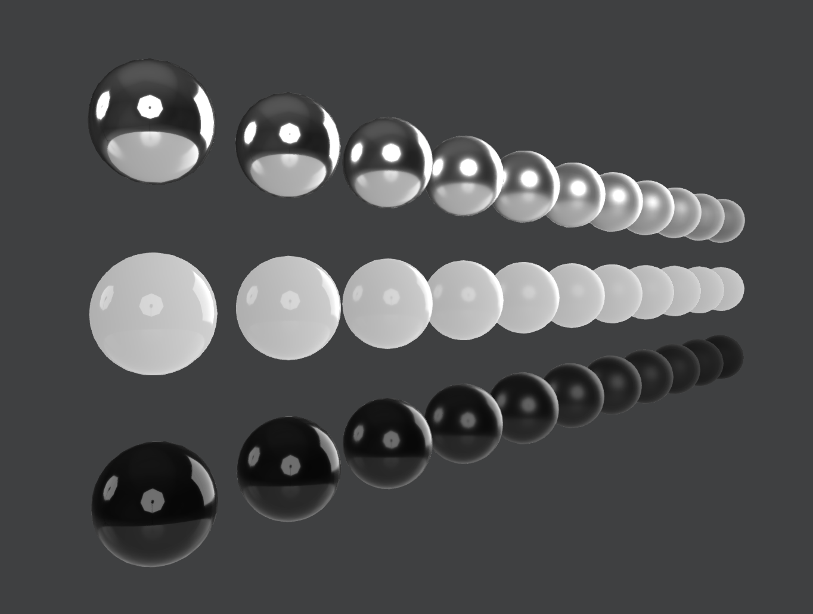

# Studio IBL

## Description
A 32-bit render of a studio environment with a large soft box light source and two umbrella light sources arranged around a light colored and reflective table top.

| Name                                            | Type       |
| ----------------------------------------------- | ---------- |
| studioSoftbox2Umbrellas_panorama_irradiance.exr | Irradiance |
| studioSoftbox2Umbrellas_panorama_radiance.exr   | Radiance   |
| studioSoftbox2Umbrellas_panorama_radiance.hdr   | Radiance   |

## License Information

  
To the extent possible under law, Microsoft has waived all copyright and related or neighboring rights to this asset.
